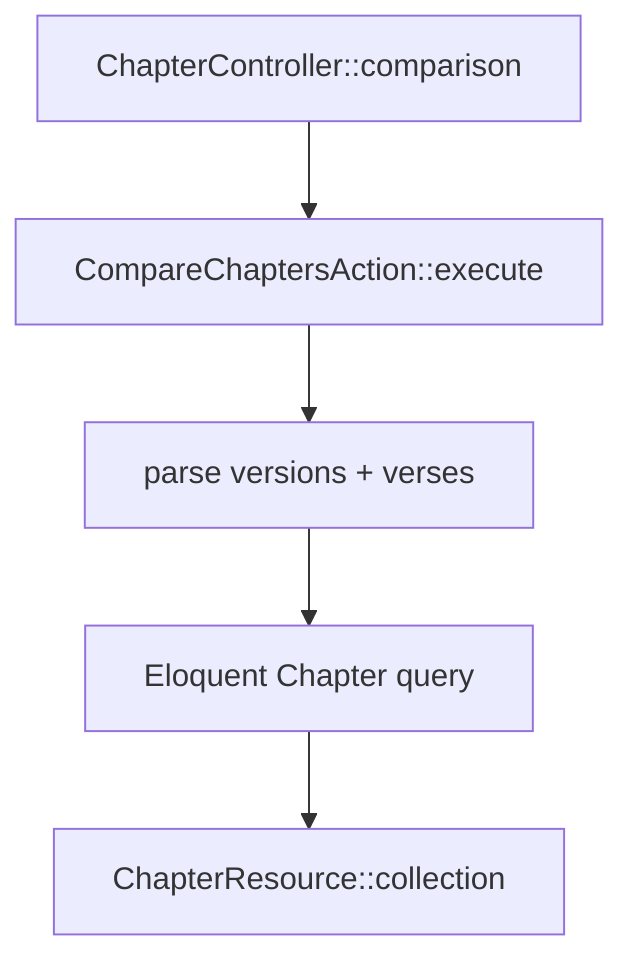

# Comparação de capítulos

Endpoint para exibir o **mesmo capítulo** em **várias versões** lado a lado (estrutura Eloquent, não DTO de leitura).

`GET /api/books/{abbreviation}/chapters/{number}/comparison`

**Sem** middleware de rate limit da rota de capítulo individual.

## Query parameters

| Parâmetro | Obrigatório | Formato | Exemplo |
|-----------|-------------|---------|---------|
| `versions` | Sim | IDs separados por vírgula | `versions=1,2,3` |
| `verses` | Não | Números e intervalos | `verses=1,3,5-10` |

### Parsing de versos (`CompareChaptersAction`)

- Vírgula separa itens: `1,3,5`
- Hífen define intervalo inclusivo: `5-10` → 5,6,7,8,9,10
- Resultado deduplicado com `array_unique`

## Fluxo



Query principal:

```17:26:app/Actions/Chapter/CompareChaptersAction.php
        return Chapter::where('number', $number)
            ->whereHas('book', fn(Builder $query) => $query
                ->where('abbreviation', $abbreviation)
                ->whereIn('version_id', $versionIds))
            ->with([
                'verses' => fn ($query) => $query->when($verseNumbers, fn($q) => $q->whereIn('number', $verseNumbers)),
                'book.version',
                'book',
            ])
            ->get();
```

## Resposta JSON

Usa `ChapterResource` (model Eloquent), aninhando `BookResource`, `VerseResource`, `VerseReferenceResource` — **diferente** do endpoint `show`, que usa `ChapterResponseResource` + DTOs.

## Limitações importantes

1. **Só PostgreSQL** — não chama `GetChapterAction` nem adapters de Api.Bible.
2. Versões com `text_source = api_bible` costumam ter **versos sem texto** no banco (import via `json_youversion`). A comparação retorna estrutura (números, livro, versão), mas o texto pode vir vazio.
3. Para comparar texto de fontes externas, seria necessário evoluir a action (ex.: chamar `GetChapterAction` por `version_id`) — hoje isso **não** está implementado.

## Quando usar cada endpoint

| Necessidade | Endpoint |
|-------------|----------|
| Ler um capítulo completo (qualquer `text_source`) | `GET .../versions/{version}/books/.../chapters/{number}` |
| Comparar trechos entre versões **importadas no DB** | `GET .../comparison?versions=...` |

## Testes

Ver [testing/overview.md](../../testing/overview.md) — use `tests/Feature/Chapter/` como referência.

## Relacionado

- [Capítulos e fontes de texto](./text-sources.md)
- [Importação de versões](../versions/import.md) — `json_youversion` + `api_bible`
