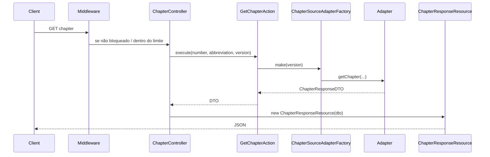

# Capítulos e fontes de texto

Endpoint principal de leitura:

`GET /api/versions/{version}/books/{abbreviation}/chapters/{number}`

Middleware: `chapter.rate_limit` → `throttle:chapter`.

## Fluxo end-to-end



### Arquivos centrais

| Arquivo | Papel |
|---------|-------|
| `app/Http/Controllers/ChapterController.php` | `show()` chama action e retorna Resource |
| `app/Actions/Chapter/GetChapterAction.php` | Factory → adapter → DTO |
| `app/Services/Chapter/Factories/ChapterSourceAdapterFactory.php` | Escolhe adapter por `version.text_source` |
| `app/Services/Chapter/Adapters/DatabaseChapterAdapter.php` | Texto no PostgreSQL |
| `app/Services/Chapter/Adapters/ApiBibleChapterAdapter.php` | Texto via [Api.Bible](https://rest.api.bible) |
| `app/Services/Chapter/Adapters/AbstractCachedChapterAdapter.php` | Cache do payload bruto + DTO sempre reconstruído |
| `app/Http/Resources/ChapterResponseResource.php` | JSON público do capítulo |

A action é intencionalmente mínima:

```12:20:app/Actions/Chapter/GetChapterAction.php
    public function execute(
        int $number,
        BookAbbreviationEnum $abbreviation,
        Version $version
    ): ChapterResponseDTO {
        $adapter = ChapterSourceAdapterFactory::make($version);

        return $adapter->getChapter($version, $abbreviation, $number);
    }
```

## Fonte do texto (`text_source`)

Definido no model `Version` (`VersionTextSourceEnum`):

| Valor | Adapter | Conteúdo |
|-------|---------|----------|
| `database` | `DatabaseChapterAdapter` | Versos importados no PostgreSQL |
| `api_bible` | `ApiBibleChapterAdapter` | HTTP para Api.Bible; estrutura de livros/capítulos no DB |

Para `api_bible` são obrigatórios na versão:

- `external_version_id` — ID da tradução na Api.Bible
- `cache_ttl` — TTL do cache em **segundos**

Para `database`, `cache_ttl` pode ser `null` (cache permanente do payload bruto).

### Variáveis de ambiente

| Variável | Uso |
|----------|-----|
| `API_BIBLE_KEY`, `API_BIBLE_BASE_URL` | Cliente HTTP Api.Bible (`config/services.php`) |
| `CACHE_STORE`, `REDIS_*` | Backend de cache (recomendado Redis) |

## Cache (`AbstractCachedChapterAdapter`)

Estratégia importante para manutenção:

1. Só o **payload bruto** (array/JSON da fonte) entra no cache.
2. A conversão para `ChapterResponseDTO` roda **em todo request** (mudanças no parser não exigem flush manual).
3. Chave: `versions:{versionId}:books:{abbrev}:chapters:{number}`
4. TTL: `versions.cache_ttl`; se `null`, `rememberForever`.

## Adapter de banco (`DatabaseChapterAdapter`)

- Confirma que o livro/capítulo existem para a versão.
- Carrega `Chapter` com `verses.references` e `book`.
- Monta `VerseResponseDTO` com texto e referências (`{{slug}}` no texto, metadados em `references`).

## Adapter Api.Bible (`ApiBibleChapterAdapter`)

- Usa o DB para saber se o capítulo existe (número de versos, estrutura).
- Busca conteúdo na API externa com `external_version_id`.
- `ApiBibleContentParser` + processadores em `app/Services/Chapter/Parsers/ApiBible/` convertem JSON em versos, títulos de seção e referências.
- `ReferenceSlugValidator` pode registrar **warnings** (não quebra a resposta).

Erros de domínio: `ChapterSourceException` (`chapter_not_found`, `external_api_error`, …).

## Rate limiting

Registrado em `AppServiceProvider` via `ChapterRateLimit::register()`.

| Regra | Valor |
|-------|-------|
| Limite | 60 requisições/minuto por **IP + version** |
| Após estourar | Bloqueio de **1 hora** (`chapter-blocked:{ip}:{versionId}`) |
| Bypass | Header `X-Api-Key` igual a `config('app.api_key')` (`API_KEY` no `.env`) |

Middleware `CheckChapterRateLimitBlock` verifica o bloqueio **antes** do throttle.

IP real: `CloudflareRealIp` lê `CF-Connecting-IP` (relevante atrás da Cloudflare).

## DTOs e Resources de resposta

| DTO | Conteúdo |
|-----|----------|
| `ChapterResponseDTO` | número do capítulo, abreviação do livro, lista de versos |
| `VerseResponseDTO` | número, texto, `titles[]`, `references[]` |
| `VerseReferenceResponseDTO` | `slug`, `text` |
| `VerseTitleDTO` | títulos/seções (principalmente Api.Bible) |

Resources: `ChapterResponseResource`, `VerseResponseResource`, `VerseReferenceResponseResource`, `VerseTitleResource`.

## Estender o sistema

### Nova fonte de texto (ex.: outro provedor externo)

1. Adicionar case em `VersionTextSourceEnum` e coluna/migration se necessário.
2. Criar adapter implementando `ChapterSourceAdapterInterface` (ou estender `AbstractCachedChapterAdapter`).
3. Registrar em `ChapterSourceAdapterFactory::make()`.
4. Ajustar `VersionRequest` / `VersionValidator` para regras do novo modo.
5. Testes: espelhe `tests/Feature/Chapter/` (ver [testing/overview.md](../../testing/overview.md)).

### Ajustar parsing Api.Bible

Editar `ApiBibleContentParser` e processadores em `Parsers/ApiBible/Processors/`. Fixture: `tests/Fixtures/api_bible_chapter_content.json`.

## Relacionado

- [Importação de versões](../versions/import.md) — como popular o DB ou estrutura vazia para Api.Bible
- [Comparação](./comparison.md) — outro endpoint que **não** usa estes adapters
- [Testes](../../testing/overview.md) — busque exemplos em `tests/Feature/Chapter/`
