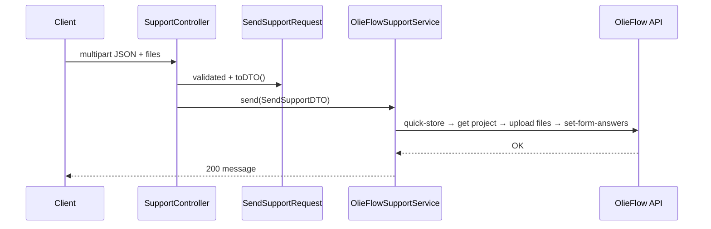

# Suporte (feedback do usuário)

Formulário público para bugs, sugestões e dúvidas, integrado ao **OlieFlow** (CRM/automação externa).

`POST /api/support` — sem autenticação.

## Fluxo



## Arquivos

| Arquivo | Papel |
|---------|-------|
| `app/Http/Controllers/SupportController.php` | Injeta `SupportServiceInterface`, chama `send` |
| `app/Http/Requests/SendSupportRequest.php` | Validação + `toDTO()` |
| `app/Services/Support/DTOs/SendSupportDTO.php` | type, description, files, ip, userAgent, email |
| `app/Services/Support/Interfaces/SupportServiceInterface.php` | Contrato |
| `app/Services/Support/OlieFlowSupportService.php` | Implementação HTTP |
| `app/Enums/Support/SupportTypeEnum.php` | `bug`, `feature`, `question`, `other` |

Bind no container (`AppServiceProvider`):

```php
$this->app->bind(SupportServiceInterface::class, OlieFlowSupportService::class);
```

## Validação HTTP (`SendSupportRequest`)

- `type` — enum `SupportTypeEnum`
- `description` — texto obrigatório
- `email` — opcional
- Anexos: até **5** arquivos; tipos imagem/vídeo/documento; máx. **20 MB** cada

O DTO captura `ip` e `User-Agent` do request atual.

## Integração OlieFlow (resumo)

`OlieFlowSupportService` executa sequência HTTP:

1. `POST /projects/quick-store` — cria projeto de suporte
2. `GET /projects/{id}` — obtém funnel step
3. `POST /dynamic-forms-answers-file` — upload de cada anexo
4. `POST /dynamic-forms/set-form-answers` — envia type, description (com metadata) e referências de arquivos

Falhas de configuração ou API → `SupportException`.

## Variáveis de ambiente (`config/services.php`)

| Variável | Uso |
|----------|-----|
| `OLIE_FLOW_BASE_URL` | Base da API |
| `OLIE_FLOW_API_KEY` | Autenticação |
| `OLIE_FLOW_STEP_ID` | Step do funil |
| `OLIE_FLOW_FORM_ID` | Formulário dinâmico |
| `OLIE_FLOW_EDGE_TYPE_ID` | Campo “tipo” |
| `OLIE_FLOW_EDGE_DESCRIPTION_ID` | Campo descrição |
| `OLIE_FLOW_EDGE_FILES_ID` | Campo arquivos |

## Trocar o backend de suporte

1. Nova classe implementando `SupportServiceInterface::send(SendSupportDTO): bool`.
2. Alterar bind em `AppServiceProvider`.
3. Manter `SendSupportRequest` / DTO se o contrato HTTP não mudar.

## Novo tipo de ticket

Adicionar case em `SupportTypeEnum` e garantir que o destino (OlieFlow ou outro) aceite o valor.

## Testes

Ver [testing/overview.md](../../testing/overview.md) — exemplos em `tests/Feature/Support/` (endpoint e `Http::fake()` no serviço).

## Relacionado

- [Exceções](../../api/exceptions-and-responses.md) — `SupportException`
- [Arquitetura](../../architecture/overview.md) — padrão interface + bind
